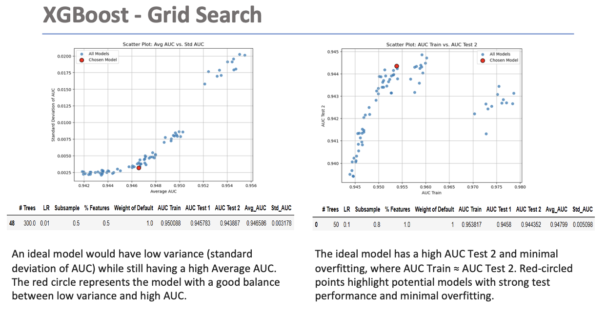
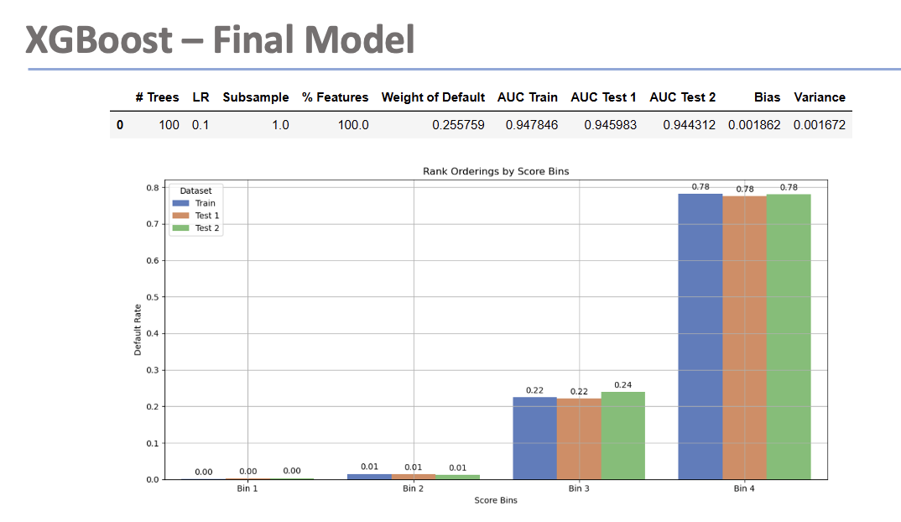
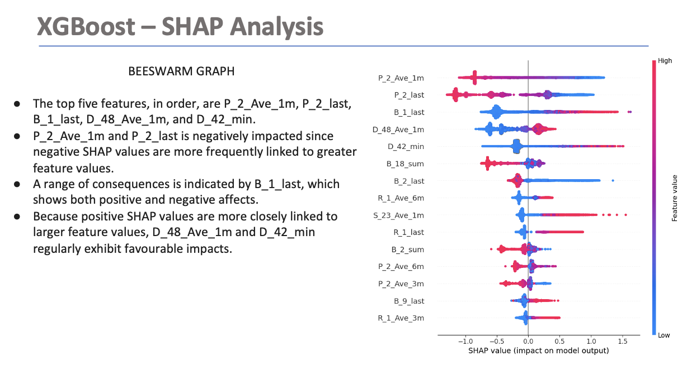
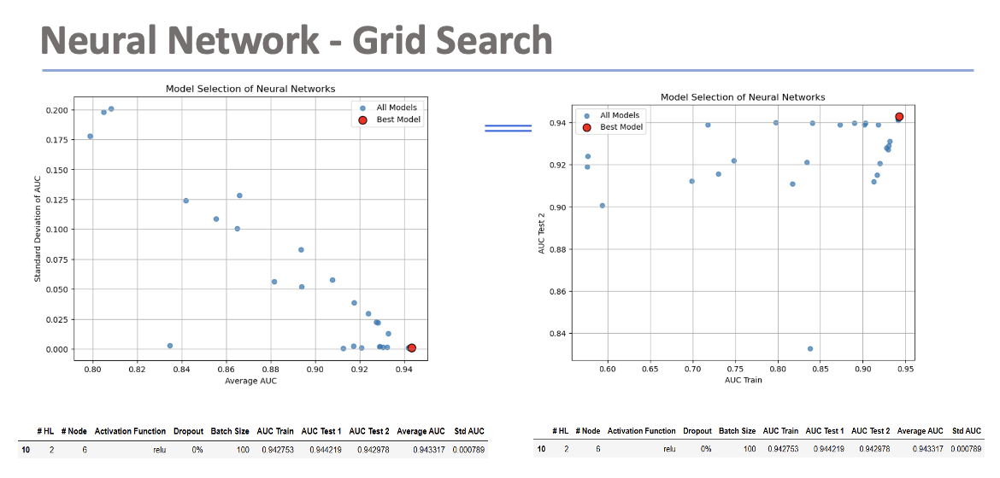
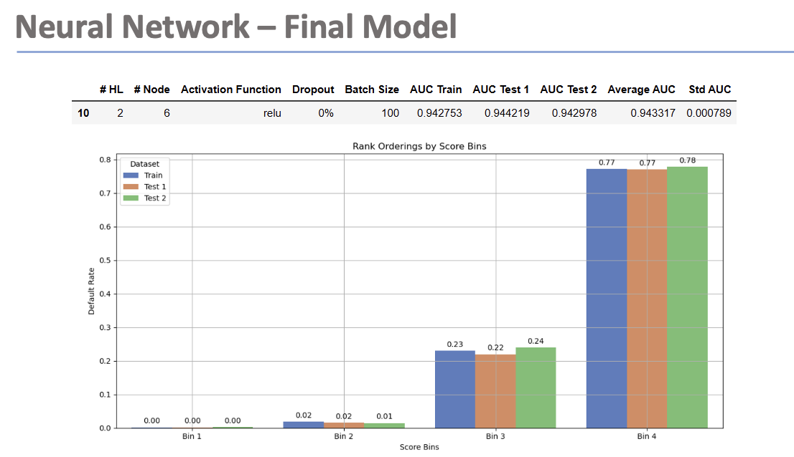

# Credit Risk Modeling — XGBoost • Neural Network • SHAP

## Overview
This project builds a predictive credit risk model to estimate the likelihood of customer default and support better lending/credit decisions. Two modeling approaches were explored:
- **XGBoost** (primary model) for strong performance + faster training
- **Neural Network** (benchmark) to compare against a deep learning baseline

The project also uses **SHAP explainability** to identify the most important drivers of default risk and provide audit-friendly model interpretation.

---

## Objectives
- Predict probability of default (classification)
- Compare model families (**XGBoost vs Neural Network**) using consistent evaluation
- Tune hyperparameters (grid search)
- Explain predictions using **SHAP** (global feature impact + interpretability)

---

## Dataset (Not Included)
The original dataset used in this project is not included in the repository (data-sharing / size / course constraints).

This repository focuses on:
- the documented approach and model results (in `reports/`)
- visual evidence of model tuning and explainability (in `assets/`)

> If you later add a small anonymized sample dataset, place it under `data/` as `sample.csv`.

---

## Workflow Summary
### 1) Data Preparation
- Cleaned data and handled missing values
- Encoded categorical features (where applicable)
- Prepared train/test split for modeling

### 2) Model Training & Tuning
**XGBoost**
- Hyperparameter tuning using grid search
- Selected final model based on performance and generalization

**Neural Network**
- Grid search to tune architecture/training parameters
- Used as a benchmark for comparison

### 3) Explainability (SHAP)
- Interpreted XGBoost predictions using SHAP to identify top default drivers
- Produced global explanation visuals to support model transparency

---

## Key Results (Visual Evidence)

### XGBoost — Grid Search (Tuning)

  

### XGBoost — Final Model (Selected)

  

### XGBoost — SHAP Analysis (Explainability)

  

---

### Neural Network — Grid Search (Tuning)

  

### Neural Network — Final Model

  

---

## Repository Structure
